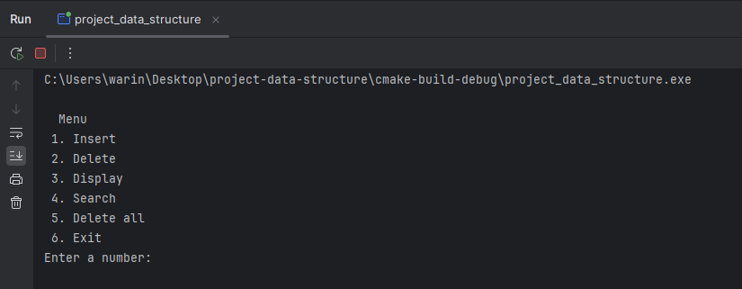

<div align="center">
  
  <h1><b>มหาวิทยาลัยเกษตรศาสตร์วิทยาเขตศรีราชา</b></h1>
  <br>
</div>

[!NOTE]
> ส่งงาน project วิชา Data Structures and Algorithms ปี 2 ภาคต้น
> โดยโปรเจคนี้ทำในหัวข้อเรื่อง Hashing


### สมาชิกในกลุ่ม
1. นางสาว อัมพุชินี บุญรักษ์
2. นาย วรินทร์ สายปัญญา
3. นาย พันธุ์ธัช สุวรรณวัฒนะ
4. นาย ปัณณวัฒน์ นิ่งเจริญ
5. นาย ปุณณภพ มีฤทธิ์

---

### เครื่องมือที่ต้องติดตั้ง
1. [Git](https://git-scm.com/downloads)
2. [GCC](https://sourceforge.net/projects/gcc-win64/)
3. [Visual Studio Code](https://code.visualstudio.com/)

---

### ขั้นตอนการติดตั้งและใช้งาน
เปิด Terminal แล้วพิมพ์คำสั่งดังต่อไปนี้

1. ดาวโหลด์ Source code ของโปรเจค
```
git clone https://github.com/WarinCode/project-data-structure.git
```

2. เข้าถึง directory
```
cd project-data-structure
```

3. รันโปรแกรม
```
gcc main.c
```

4. หรือจะเปิดโปรแกรมที่ชื่อ `main.exe` ก็ได้จะได้หน้าตาประมาณนี้

